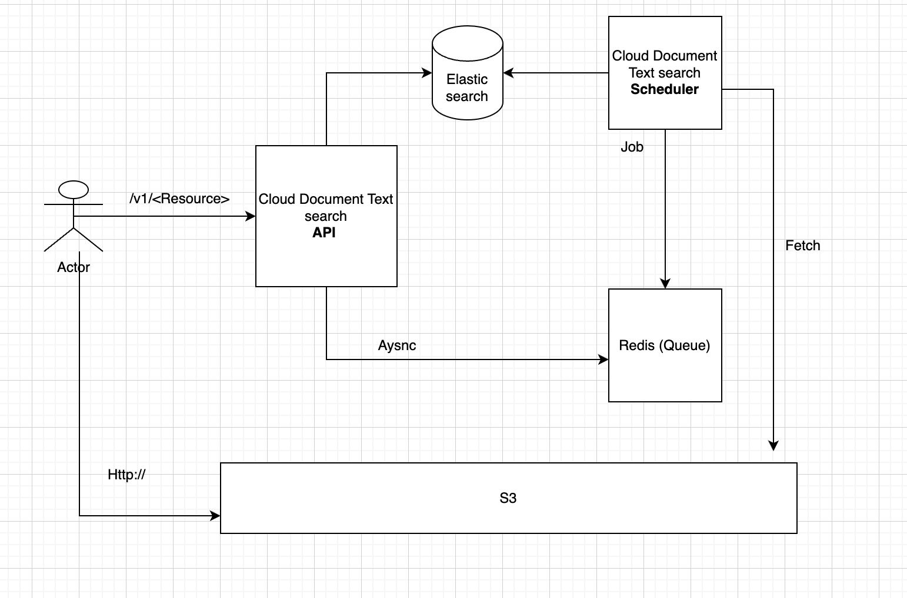

# Cloud Document Text Search
Design and build an application that can search documents from a cloud storage service like S3 or Google drive on the content inside the document.

## Project requirement document (PRD)
- https://trello.com/b/uAMqCHhN/document-text-search

## Requirements 
### Docker run 
- docker
### Local machine
- node 14+
- Redis
- Elastic-search

## Installation
### Docker
docker-compose up

### Local
- make install
- make ci

### TTY1
- npm run install cloud-document-text-search-api 

### TTY2
- npm run install cloud-document-scheduler

## API Doc
- http://localhost:8000/v1/api-docs

## Architecture 
